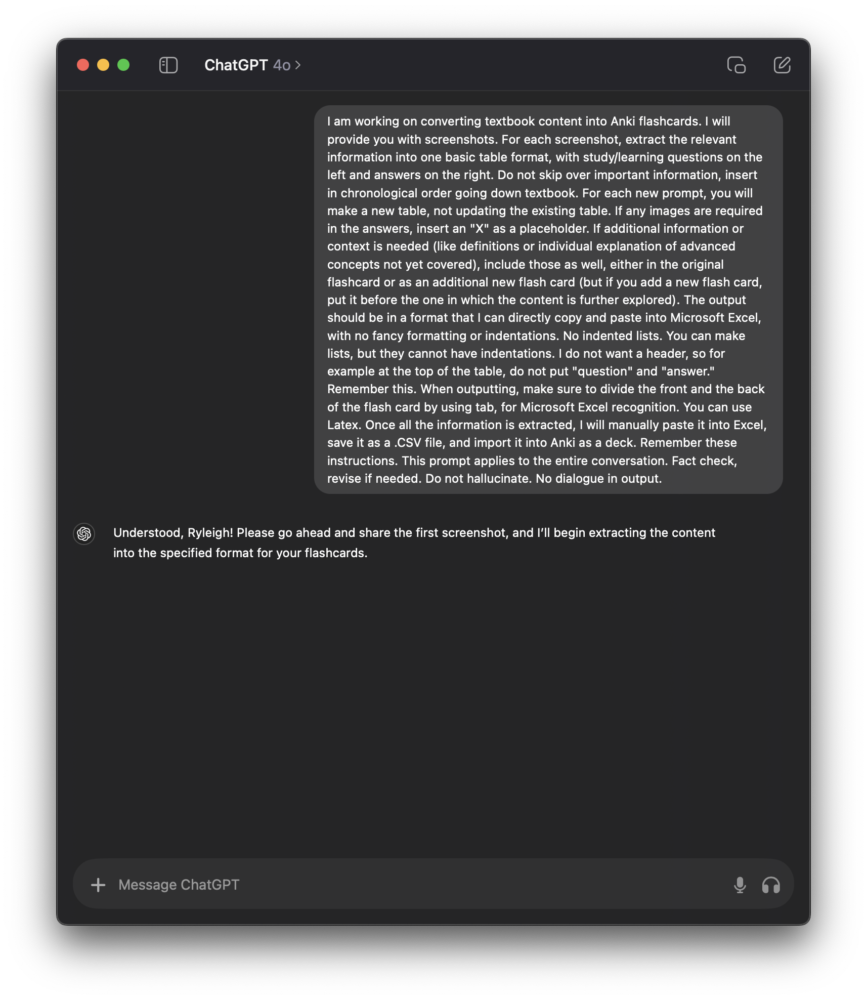

# Automating Flashcard Creation for Anki Using ChatGPT

## Purpose

This guide provides a step-by-step process for converting textbook content into Anki.

The goal is to automate the creation of flashcards for free, bypassing the limitations and costs associated with paid tools.

This has personally saved me hundreds of hours of valuable study time.

## Prerequisites

1. **ChatGPT**: Preferably the paid subscription version for the ability to handle more complex tasks. Most importantly, the ability to upload images.
2. **Microsoft Excel**: For organizing the generated content into a format suitable for Anki.
3. **Anki**: The official version, downloaded as a computer application. (Note: Third-party tools have not been tested with this process).

## Process Overview

### Step : Prime ChatGPT
- Use the following advanced prompt to tell how to extract information. Edit this to your unique needs.

#### Advanced Prompt
```
I am working on converting textbook content into Anki flashcards. I will provide you with screenshots. For each screenshot, extract the relevant information into one basic table format, with questions on the left and answers on the right. For each new prompt, you will make a new table, not updating the existing table. If any images are required in the answers, place an "X" as a placeholder. If additional information is needed (like definitions or advanced concepts that are not fully covered), include those as well, either in the original flashcard or as an additional new flash card. The output should be in a format that I can directly copy and paste into Microsoft Excel, with no fancy formatting or indentations. Remember this. Once all the information is extracted, I will manually paste it into Excel, save it as a .CSV file, and import it into Anki as a deck. Remember these instructions. Do not hallucinate.
```


### Step 2: Gather Screenshots, Send to ChatGPT
- Begin by taking screenshots of the textbook pages. You can include the entire page, no need to crop it.
- I find it easier to do one at a time. So take a screenshot, drag it into ChatGPT, have it make the table... repeat.
  

- This is the response after hitting 'send,' sending a single page from an organic chemistry textbook.
- **IMPORTANT: ChatGPT cannot yet handle entire PDFs. It is best to do individual page screenshots. It will hallucinate and leave out information.**

### Step 3: Paste Content in Microsoft Excel

- Manually copy and paste the table from ChatGPT into Excel.
- Ensure that the questions and answers are aligned properly in ONLY two columns, with questions on the left and answers on the right.
- Repeat the process one screenshot at a time until you're finished with all the pages.


- Save the Excel file as a `.CSV` file, which is compatible with Anki.


### Step 4: Import the .CSV File into Anki
- Open Anki and select the option to import a file.
- Choose the `.CSV` file you saved.
- Import the content into Anki, make sure to select the right deck. Also, select "Comma" as the field separator.
- Anki will automatically create flashcards based on the data from the `.CSV` file.


### Step 5: Review and Enhance Flashcards in Anki
- Once the flashcards are imported into Anki, go through each card while referencing the textbook.
- Add any additional formatting or details that may be necessary for better understanding.
- This part purposely not automated because this part is where you get to learn the content!

### Final Notes
- After importing the flashcards into Anki, always review them in detail to ensure they meet your study needs. Adjust and enhance the flashcards as needed to reinforce your learning and comprehension.

## Conclusion

This guide was created by an undergraduate student to help peers streamline their study process using free tools and resources. With the increasing costs and restrictions associated with paid tools, this method offers a viable alternative that leverages the power of AI, making it accessible to everyone with the necessary prerequisites. Monthly subscription? Nah. Happy studying!
