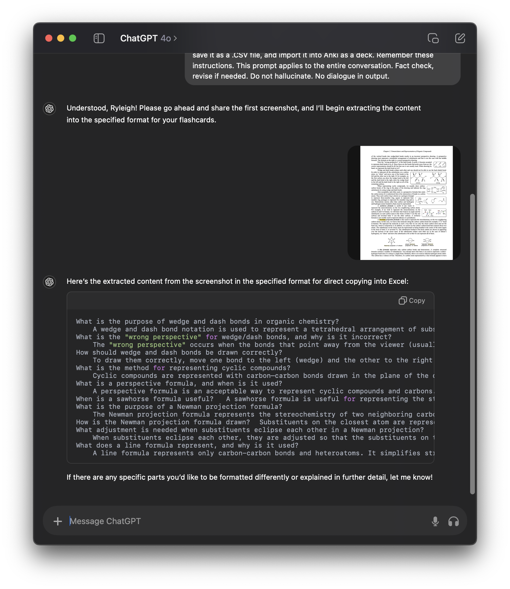

# Automating Flashcard Creation for Anki Using ChatGPT

## Purpose

This guide provides a step-by-step process for converting your textbook content into Anki cards.

The goal is to make flashcards for free quickly, bypassing the limitations and costs of paid tools.

This has personally saved me hundreds of hours of valuable study time!

## Prerequisites

1. **ChatGPT**: It is recommended to have paid subscription version for the ability to upload many images (and to handle more complex tasks).
2. **Microsoft Excel**: For pasting and saving as `.CSV`.
3. **Anki**: The official version only.

## Process Overview

### Step 1: Prime ChatGPT
- Use the following advanced prompt to ChatGPT it how to extract information. You can edit this to your unique needs.

#### Advanced Prompt
```
I am working on converting textbook content into Anki flashcards. I will provide you with screenshots. For each screenshot, extract the relevant information into one basic table format, with questions on the left and answers on the right. For each new prompt, you will make a new table, not updating the existing table. If any images are required in the answers, place an "X" as a placeholder. If additional information is needed (like definitions or advanced concepts that are not fully covered), include those as well, either in the original flashcard or as an additional new flash card. The output should be in a format that I can directly copy and paste into Microsoft Excel, with no fancy formatting or indentations. Remember this. Once all the information is extracted, I will manually paste it into Excel, save it as a .CSV file, and import it into Anki as a deck. Remember these instructions. Do not hallucinate.
```


### Step 2: Gather Screenshots, Send to ChatGPT
- Take screenshots of all your textbook pages. You can include the entire page, no need to crop it for formatting purposes. Unnecessary info will be omitted automatically.
- Upload and send one page at a time.
- **IMPORTANT: ChatGPT cannot handle entire PDFs. It is best to do individual page screenshots, or a word count equivalent (500 max). Otherwise it may hallucinate and/or leave out information.**
  

- The above inage is the response after hitting 'send,' sending a single page screenshot of an organic chemistry textbook.

### Step 3: Paste Content in Microsoft Excel

- Each time you send a photo, you will get a new table.
- Manually copy and paste the table from ChatGPT into Excel.
- Ensure that the questions and answers are aligned properly in ONLY two columns, with questions on the left and answers on the right.
- Repeat the process one screenshot at a time until you're finished with all the pages. You can merge all of your flashcards into one big file.


- Save the file as a `.CSV`, which is compatible with Anki.


### Step 4: Import the .CSV File into Anki
- If you haven't made a deck for your cards, make it first.
- Now, open Anki and select the option to Import.
- Choose the `.CSV` file you saved.
- Import, make sure to select the right deck. Also, select "Comma" as the Field Separator.
- Anki will automatically loqd flashcards from the data in the `.CSV` file.


### Step 5: Review and Enhance Flashcards in Anki
- Once the flashcards are imported into Anki, I recommend going through each card while simultaneously referencing your textbook.
- There shouldn't be many errors, if anything small formatting or number misunderstandings. Be cautious of this.
- Add any additional formatting, explanations, or details that may be necessary for better understanding.
- **This part purposely not automated because it is where you get to learn and interact with the content!**

- **Before Formatting (below)**


- **After Formatting (below)**


### Final Notes
- After importing the flashcards into Anki, always review them in detail to ensure they meet your study needs. Adjust and enhance the flashcards as needed to reinforce your learning and comprehension.
- If your textbook has exercise questions (for example), you can have ChatGPT backtrace older images you uploaded, and make a table with just these exercises.
- if there is something unique you want to do, I recommend changing the prompts or making your own and giving it a go! AI is very capable.

## Conclusion

This guide was created to help streamline my study process. This method is an alternative to (painstakingly limited and expensive) paid tools. 

Monthly subscription? Nah... Well except for ChatGPT... I do think that is worth it though. Happy studying!

Do you need help? Find me at [ryleighnewman.com](https://ryleighnewman.com)

## Copyright Disclaimer

Content owners may not want their works to be uploaded to AI tools. 

I am not responsible for any copyright infringement. Consult authors for permission.
