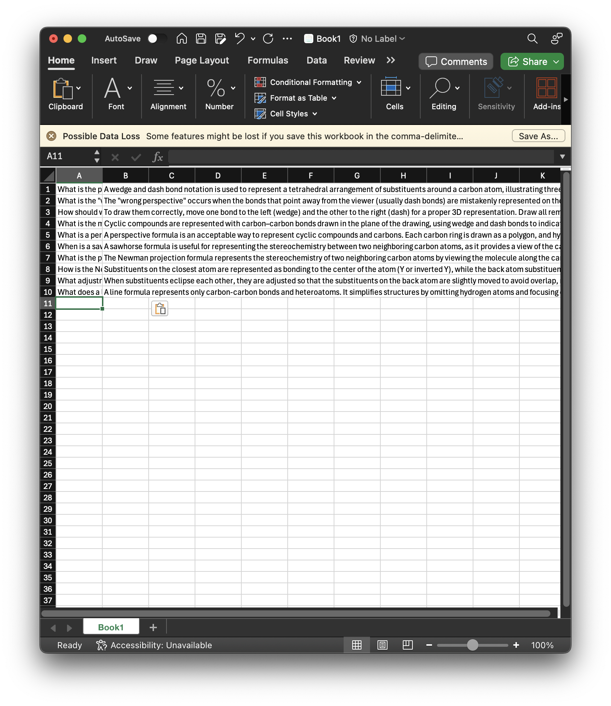
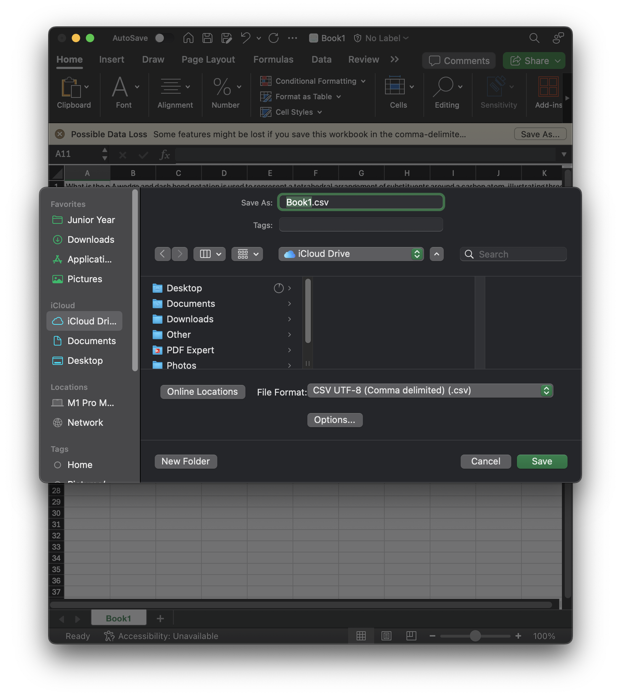

# Automating Flashcard Creation for Anki Using ChatGPT

## Purpose

This guide provides a step-by-step process for converting textbook content into Anki cards.

The goal is to make flashcards quickly, bypassing the limitations and costs of paid tools.

The AI dissects valuable information and breaks it chronologically into cards, breaking content into sections and asking questions.

It does not do all of the work though. It's more of a outline tool, purposely.

This process saves time and organizes content for study. So you can dive right into structured learning.

This method has saved me hundreds of hours of valuable study time. And I have scored 100s on organic chemistry exams solely with this approach!

## Prerequisites

1. **ChatGPT**: It is *recommended* to have paid subscription version for the ability to upload many images (and to handle more complex tasks).
2. **Microsoft Excel**: For pasting and saving as `.CSV`.
3. **Anki**: The official version only. Application form recommended.

## Process Overview

### Step 1: Prime ChatGPT
- Use the following Advanced Prompt to tell ChatGPT how to extract information. You can edit this to your unique needs. 
- I have designed this prompt specifically to handle all of the common errors and possible problems unique to ChatGPT. Updated for the early October 2024 ChatGPT 4o build.

#### Advanced Prompt
```
I am working on converting textbook content into Anki flashcards. I will provide you with screenshots. For each screenshot, extract the relevant information into one basic table format, with questions on the left and answers on the right. For each new prompt, you will make a new table, not updating the existing table. If any images are required in the answers, place an "X" as a placeholder. If additional information or context is needed (like definitions or individual explanation advanced concepts not yet covered), include those as well, either in the original flashcard or as an additional new flash card (which would be placed before the corresponding flash card). The output should be in a format that I can directly copy and paste into Microsoft Excel, with no fancy formatting or indentations. No indented lists. You can make lists, but they cannot have indentations. I do not want a header, so for example at the top of the table, do not put "question" and "answer." Remember this. When outputting, make sure to divide the front and the back of the flash card by using tab, for Microsoft Excel recognition. You can use Latex. Once all the information is extracted, I will manually paste it into Excel, save it as a .CSV file, and import it into Anki as a deck. Remember these instructions. This prompt applies to the entire conversation. Fact check, revise if needed. Do not hallucinate. No dialogue.
```

- The prompt may have been been updated since the image below was taken.


### Step 2: Gather Screenshots, Send to ChatGPT
- Take screenshots of all your textbook pages. You can include the entire page, no need to crop it perfectly for formatting purposes. Unnecessary info will be omitted automatically. Just make sure it is legible.
- Upload and send one page at a time.
- **IMPORTANT: ChatGPT cannot reliably handle entire PDFs. It is best to do individual page screenshots. Alternatively, you can paste text, but any diagrams will not be accounted for. Otherwise it may hallucinate and/or leave out information.**
- The image below is the response after hitting 'send,' sending a single page screenshot of an organic chemistry textbook. The output can either be a visual table, or plain text. Either should work.
  


### Step 3: Paste Content in Microsoft Excel

- Each time you send a photo, you will get a new table.
- Manually copy and paste the table from ChatGPT into Excel. 
- Ensure that the questions and answers are aligned properly in **ONLY** two columns, with questions on the left and answers on the right.
- Repeat the process one screenshot at a time until you're finished with all the pages. You can merge all of your flashcards into one big file.
- You can have ChatGPT merge all the flashcards into one big table/box in the end for ease of copying, but you may find numerous formatting errors. Formatting errors will break flashcards.
- It should look like:



- Now, save the file as a `.CSV`, which is compatible with Anki. Only use this file type.



### Step 4: Import the .CSV File into Anki
- If you haven't made a deck for your cards, make it first.
- Now, open Anki and select the option to Import. The button should be on the main page, middle bottom.
- Choose the `.CSV` file you saved.
- Import, make sure to select the right deck. Also, select "Comma" as the Field Separator.
- Anki will automatically load flashcards from the data in the `.CSV` file.


### Step 5: Review and Enhance Flashcards in Anki
- Once the flashcards are imported into Anki, I recommend going through each card while simultaneously referencing your textbook.
- There shouldn't be many errors, if anything small formatting or number misunderstandings. Be cautious of this.
- Add any additional formatting, explanations, or details that may be necessary for better understanding.
- **This part purposely not automated because it is where you get to learn and interact with the content!**

- **Before Formatting (below)**
- We can see that it extracted a question, and put in a factual yet basic answer.


- **After Formatting (below)**
- I added an excessive amount of explanation so that I could understand this concept. Just an example of what formatting can look like.


### Final Notes
- After importing the flashcards into Anki, always review them in detail to ensure they meet your study needs. 
- Adjust and enhance the flashcards as needed to reinforce your learning and comprehension.
- If your textbook has exercise questions (for example), you can have ChatGPT backtrace older images you uploaded, and make a table with just these exercises.
- if there is something unique you want to do, I recommend changing the prompts or making your own and giving it a go! AI is very capable.
- ChatGPT has issues... see below.

## Is ChatGPT Giving You Problems?
The AI can freak out in special scenarios. Below are the most common examples and what to do.
- **Slow Output:** Close the website and reopen it (yes this actually can work).
- **Internal Server Error:** Oftentimes just a ChatGPT bug. Refresh your page.
- **Won't Make a Proper Table:** The system is overloaded. Create a new chat, and tell it to clear memory. Then resume; re-enter the Advanced Prompt.
- **Other Errors:** ChatGPT often becomes overwhelmed when a chat becomes too long, meaning there are many messages in one thread. Follow the previous bullet point steps to clear memory. Simply tell it:
```
Clear all memory.
```

## Conclusion

This guide was created to help streamline my study process. This method is an alternative to (painstakingly limited and expensive) paid tools. 

Anki is such a powerful studying tool, and AI only makes it easier to work with.

Monthly subscription? Nah... Well except for optional ChatGPT Plus... I do think that is worth it though. Happy studying!

Do you need help? Find me at [ryleighnewman.com](https://ryleighnewman.com)

## Copyright Disclaimer

Content owners may not want their works to be uploaded to AI tools. 

I am not responsible for any copyright infringement. Consult authors for permission.
